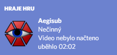
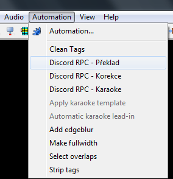
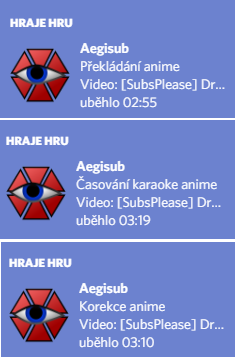

# Aegisub DiscordRPC
Lua plugin (makro) pro Aegisub, sloužící k výstupu informací
momentálně upravovaných titulek do Discord Rich Presence

## Instalace
- Umístěte soubor `discord-rpc.dll` do instalační složky s Aegisubem.
  - Pokud používáte 64-bitovou verzi Aegisubu, použijte prosím
    soubor `discord-rpc-64.dll` a pojmenujte ho jako `discord-rpc.dll` 
    před umístěním do Aegisub složky.
- Umístěte skript `discord-rpc_cz.lua` do složky `automation\autoload`.

### Příklad
Pokud jste instalovali Aegisub do složky `C:\Program Files (x86)\Aegisub` tak:
- Umístěte `discord-rpc.dll` do `C:\Program Files (x86)\Aegisub`.
- Umístěte `discord-rpc_cz.lua` do `C:\Program Files (x86)\Aegisub\automation\autoload`.

## Použití
Po správné instalaci při startu zobrazí rich presense
`Nečinný` a v dalším řádku `Video nebylo načteno` jako stav
při každém spuštění Aegisubu.

Pak načtěte titulky a video a klikněte na jednu z možností 
z nabídky `Automation` pro aktualizace údajů Rich Presence.

### Varování
Před aktualizací se ujistěte, že:
- Máte načtené video.
- Máte načtené titulky, obsahující cestu k videosouboru.