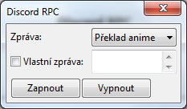

# Aegisub DiscordRPC (CZ)
Lua skript pro Aegisub, sloužící k výstupu informací
momentálně upravovaných titulek do Discord Rich Presence

Navštivte nás na adrese https://www.teamnshonyaku.cz nebo na discordu https://discord.gg/teamns
## Instalace
### Aktualizace
- Pokud aktualizujete skript ze starší verze, stačí jen
  umístit skript `discord-rpc_cz.lua` do složky `automation\autoload`
### Nová instalace
- Umístěte soubor `discord-rpc.dll` do instalační složky s Aegisubem.
  - Pokud používáte 64-bitovou verzi Aegisubu, použijte prosím
    soubor `discord-rpc-64.dll` a pojmenujte ho jako `discord-rpc.dll` 
    před umístěním do Aegisub složky.
- Umístěte skript `discord-rpc_cz.lua` do složky `automation\autoload`.
### Příklad
Pokud jste instalovali Aegisub do složky `C:\Program Files (x86)\Aegisub`, tak:
- Umístěte `discord-rpc.dll` do `C:\Program Files (x86)\Aegisub`.
- Umístěte `discord-rpc_cz.lua` do `C:\Program Files (x86)\Aegisub\automation\autoload`.
## Upozornění
Při spouštění pod Windows 10 je nutné spouštět Aegisub jako správce z důvodu oprávnění k zápisu konfiguračního souboru
## Použití
Po správné instalaci se při každém spuštění 
Aegisubu zobrazí v Rich Presence tato zpráva:

Pokud se nic nezobrazilo, tak zkuste spustit Aegisub jako správce.

Pak načtěte titulky a video a klikněte na možnost `Nastavení` 
z nabídky `Discord RPC` v kartě `Automation` pro otevření menu nastavení údajů Rich Presence.

Zde můžete zvolit zprávu, ikonu, skrýt název videa nebo zakázat spouštění skriptu.
Po kliknutí na tlačítko "Uložit" zůstanou údaje uloženy i po opětovném spuštění Aegisubu.

Pak už stačí zvolit možnost `Aktualizovat údaje` z nabídky `Discord RPC` v kartě `Automation`

