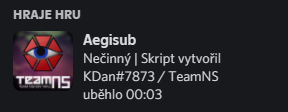
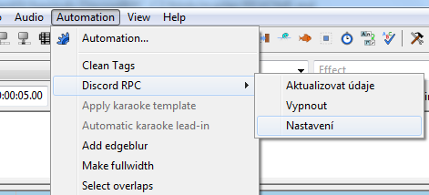
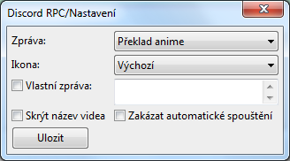
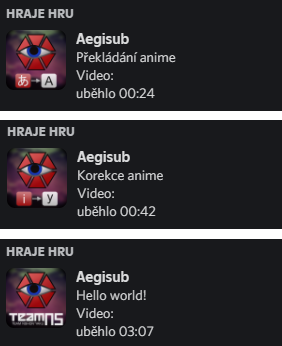

# Aegisub DiscordRPC (CZ)
Lua skript pro Aegisub, sloužící k výstupu informací
momentálně upravovaných titulek do Discord Rich Presence

Navštivte nás na adrese https://www.teamnshonyaku.cz nebo na discordu https://discord.gg/vdMh2kB
## Instalace
### Aktualizace
- Pokud aktualizujete skript ze starší verze, stačí jen
  umístit skript `discord-rpc_cz.lua` do složky `automation\autoload`
### Nová instalace
- Umístěte soubor `discord-rpc.dll` do instalační složky s Aegisubem.
  - Pokud používáte 64-bitovou verzi Aegisubu, použijte prosím
    soubor `discord-rpc-64.dll` a pojmenujte ho jako `discord-rpc.dll` 
    před umístěním do Aegisub složky.
- Umístěte skript `discord-rpc_cz.lua` do složky `automation\autoload`.

### Příklad
Pokud jste instalovali Aegisub do složky `C:\Program Files (x86)\Aegisub`, tak:
- Umístěte `discord-rpc.dll` do `C:\Program Files (x86)\Aegisub`.
- Umístěte `discord-rpc_cz.lua` do `C:\Program Files (x86)\Aegisub\automation\autoload`.

## Použití
Po správné instalaci se při každém spuštění 
Aegisubu zobrazí v Rich Presence tato zpráva:

Pokud se nic nezobrazilo, tak zkuste spustit Aegisub jako správce.

Pak načtěte titulky a video a klikněte na možnost `Discord RPC` 
z nabídky `Automation` pro otevření menu aktualizace údajů Rich Presence.

Zde můžete zvolit typ zprávy, ikonu, skrýt název videa nebo vypnout RPC:

### Upozornění
Aktualizace údajů může chvíli trvat

Před aktualizací se ujistěte, že:
- Máte načtené video.
- Máte načtené titulky, obsahující cestu k videosouboru.

